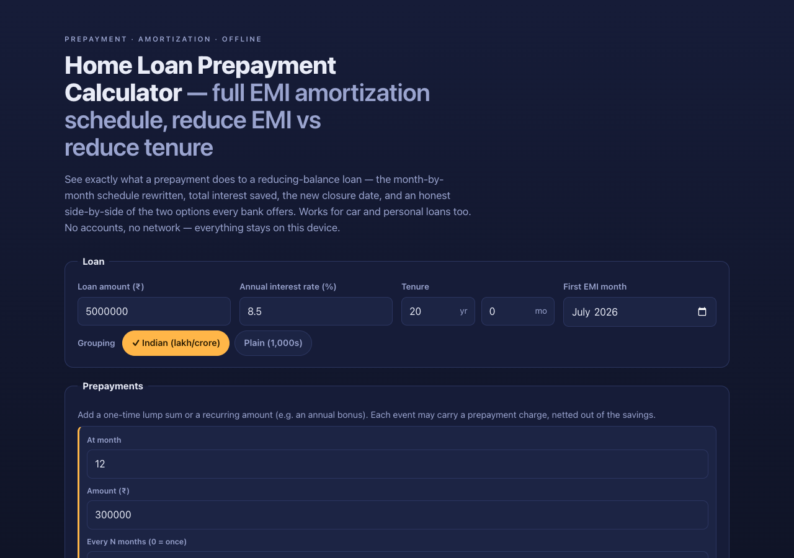

# preclose

**See exactly what a prepayment does to your loan.** A home loan prepayment
calculator that rewrites your full month-by-month EMI amortization schedule,
shows the total interest saved and the new closure date, and gives an honest
side-by-side of the two options every bank offers — **reduce EMI vs reduce
tenure**. 100% client-side, zero dependencies, works fully offline. Built
India-first (₹, lakh/crore grouping, floating-rate repricing) but the annuity
math is universal.

## Why

Your bank's calculator shows you an EMI. It does not show you the true
month-by-month interest cost, and it certainly does not show you what a bonus or
windfall would do if you put it into the loan. The two choices a bank gives you
when you prepay — keep the EMI and finish early (reduce tenure), or keep the end
date and lower the EMI (reduce EMI) — are almost never explained with real
numbers for *your* loan.

preclose does exactly that. Type in your loan, add a one-time or recurring
prepayment, and it rebuilds the entire amortization schedule, draws the
outstanding-balance burn-down, and tells you plainly which strategy saves more
and by how much — before you walk into the branch.

## Features

- **Full amortization schedule** — opening balance, EMI, interest, principal,
  closing balance, cumulative interest, grouped by year, collapsible, with a
  final-row paisa reconciliation so the loan closes at exactly ₹0.
- **Prepayment events** — one-time lump sums and recurring amounts (e.g. an
  annual bonus every 12 months), each with an optional prepayment charge (flat ₹
  or %) that is netted honestly out of the savings figure.
- **The verdict** — reduce-tenure vs reduce-EMI computed side by side: net
  interest saved, months erased, new EMI, new closure date, and a one-line call
  on which wins.
- **Twin burn-down chart** — the outstanding balance drawn twice on one inline
  SVG: the periwinkle baseline gliding to its far-off zero vs the amber curve
  diving to zero months earlier, with a hatched "months erased" span and a bright
  closure tick.
- **Rate changes (beta)** — floating-rate repricing at a chosen month, with the
  bank's two handling choices (keep the EMI and stretch the tenure, or re-derive
  the EMI for the remaining tenure). *This feature is still being hardened for the
  full combinatorial matrix of rate changes × recurring prepayments × handling
  modes × strategies — treat its figures as indicative.*
- **Named scenarios** — save/load configurations in your browser (e.g. "bonus in
  month 12 vs 24"), with duplicate-and-tweak.
- **Export as handoff** — RFC-4180 CSV of the full rewritten schedule, plus a
  clean print-to-PDF stylesheet covering the verdict and schedule.
- **Honest-model note beside the results** — the monthly-rest vs bank
  daily-reducing deviation is stated on-screen, not buried in fine print.
- **100% offline** — no accounts, no network calls, no tracking.

## The math

Every number on screen is computed from your inputs — there is no data corpus.
The core formulas, re-derived and cross-checked to the paisa in `node --test`:

- **EMI** = P · i · (1 + i)ⁿ / ((1 + i)ⁿ − 1), with i = annual rate ÷ 12; at 0%,
  EMI = P / n exactly.
- **Outstanding balance** B(k) = P · (1 + i)ᵏ − EMI · ((1 + i)ᵏ − 1) / i.

The closed-form balance is cross-checked against the iterative month-by-month
schedule at every month. All money is computed in **integer paise** and formatted
for display only.

## Quickstart

Just open `index.html` in any modern browser — no build step, no server, no
install.

- **Local:** double-click `index.html`, or run a static server in the folder.
- **Hosted:** **[Open preclose live](https://sreenivas-sadhu-prabhakara.github.io/preclose/)**
- **Tests:** `node --test` (Node 20+).

Your scenarios are saved in your browser's local storage, so they persist between
visits. Clearing site data deletes them — export the CSV to keep records.

## Privacy

- A strict Content-Security-Policy sets `connect-src 'none'`: the app **cannot**
  make any network request even if it tried. The browser itself blocks any send —
  this is an enforced guarantee, not a promise.
- No external fonts, scripts, images, or analytics. Everything is self-contained.
- All logic runs in your browser. Your loan details are never transmitted or
  stored anywhere but your own device.

## Honest limits

- **Monthly-rest reducing-balance model.** Banks use daily-reducing balances and
  broken-period interest on the first partial month, so figures may differ from
  your statement by small (typically rupee-level, not thousand-rupee-level)
  amounts. This is shown next to the results, not buried.
- Assumes every EMI is paid on its due date; missed payments, late fees, and penal
  interest are not modeled.
- Rate changes apply from the start of the month you specify; the tool does not
  model your bank's specific reset-date or spread-reset rules.
- Prepayment charges are whatever you enter — the tool does not know your bank's
  fee schedule. The Reserve Bank of India bars foreclosure charges / pre-payment
  penalties on floating-rate term loans to **individual** borrowers
  (RBI/2013-14/582, 7 May 2014), but confirm against your sanction letter. See
  [`sources/CITATIONS.md`](./sources/CITATIONS.md).

## Disclaimer

preclose is an informational calculator provided for educational purposes only.
It is **not financial advice** and not a substitute for your lender's official
statement. It uses a standard monthly-rest reducing-balance model; results may
differ from your bank's daily-reducing figures. Verify any prepayment decision
against your lender's official terms before acting. This software is provided
under the MIT License, "as is", without warranty of any kind; the author accepts
no liability for any loss or damage arising from its use.

## License

[MIT](./LICENSE) © 2026 Sreenivas Sadhu Prabhakara
